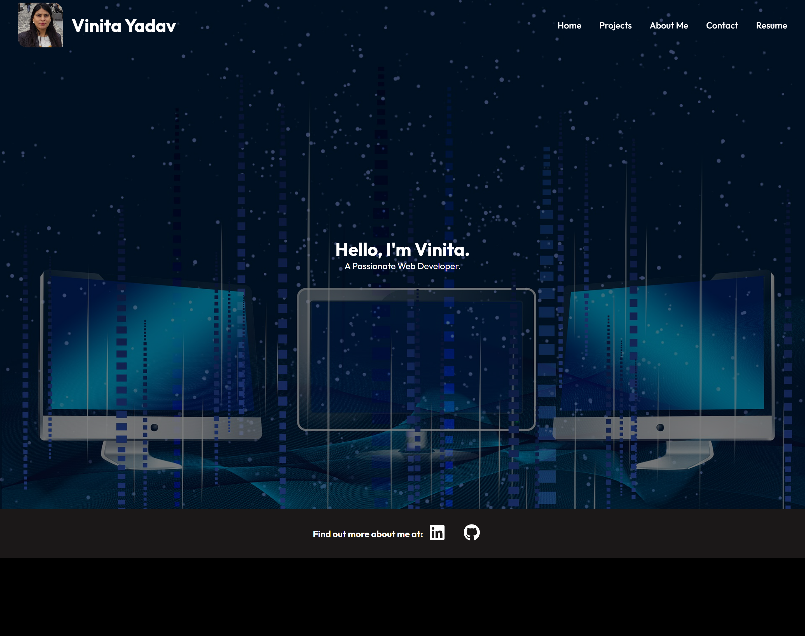

# My Portfolio-React
  
  ## Table of Contents:
  - [Description](#description)
  - [Installation](#installation)
  - [Usage](#usage)
  - [Contributing](#contributing)
  - [Credits](#credits)
  - [License](#license)
  - [Questions](#questions)

  ## Description
  This project is about making my Portfolio using React application.

  ## Installation
  This application needs Installation of: 
  - React -App
  - react-router-dom
  - react-icons
  

  ## Usage
  This application is to showcase my portfolio. Have a look at my Deployed Link.
  Here's a sneak peak of different pages of the application:
  - Home 
  
  - Projects
  
  - About
  
  - Contact
  
  
  ## Credits
  - A sincere thanks to edX bootcamp and the instructional staff for helping me to reach uptill here.
  - My tutor Alexis Gonzalez who helped me understand the react-router concepts.
  - A tutorial by [Tech2 etc](https://www.youtube.com/watch?v=0h2b4ftbZcU), which briefly explains the use of ract components and routers.
  - And not to forget my friend Maudmain, she helped me to understand the whole concept when i was feeling lost.
  - Pixabay for the images used in my application. 

  ## Contributing
  You are welcome for contributing. Please ensure to raise a PR before merging.

  
  ## License
  This Application is under  License.

  ## Questions
   * Visit my [Github](Vinita686) profile.

  * If you have some additional questions or suggestions you can reach me at :  yadav.vinita@gmail.com
